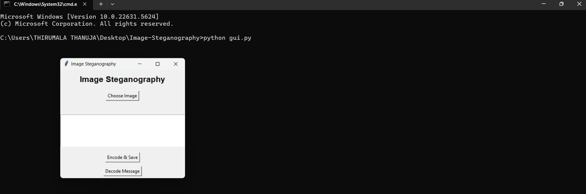

🖼️ Image Steganography using Python

Hide secret messages inside images using the power of Python and LSB (Least Significant Bit) steganography.

---

📌 Features

🔐 Hide any text message inside an image

🕵️ Extract hidden messages from encoded images

🖼️ Works with PNG and RGB images

💻 Easy-to-use Command-Line Interface (CLI)

---

🛠️ Tech Stack

Python 3

Pillow (PIL) for image processing

argparse for command-line argument parsing

---

🚀 How It Works

It modifies the least significant bits (LSBs) of pixel values in an image to embed a secret message.
An EOF marker (11111110) indicates the end of the message during decoding.

---

📂 Project Structure

Image-Steganography/
│
├── cli.py             # Command-line interface
├── stegano.py         # Core encode/decode logic
├── input.png          # Original image (for encoding)
├── output.png         # Encoded image with hidden message
├── screenshots/
│   └── cli-output.png # Screenshot of encode/decode in terminal
└── README.md          # Project documentation

---

▶️ How to Use

> 📦 Install required library:

pip install Pillow

🔐 Encode a message:

python cli.py encode input.png output.png "Hello"

🕵️ Decode a hidden message:

python cli.py decode output.png

---

🧪 Example Output

[+] Message encoded and saved to output.png
[+] Hidden Message: Hello

---

🖼️ Screenshots

✅ Encoding and Decoding in Action:

  <!-- Make sure this filename matches your actual image -->

---

📌 Limitations

Only works with RGB images (PNG format recommended)

Message size limited by image pixel count

---

📄 License

This project is licensed under the MIT License.

---

👩‍💻 Author

Thirumala Thanuja
🌐 https://www.linkedin.com/in/thanuja-thirumala-9aa550280

